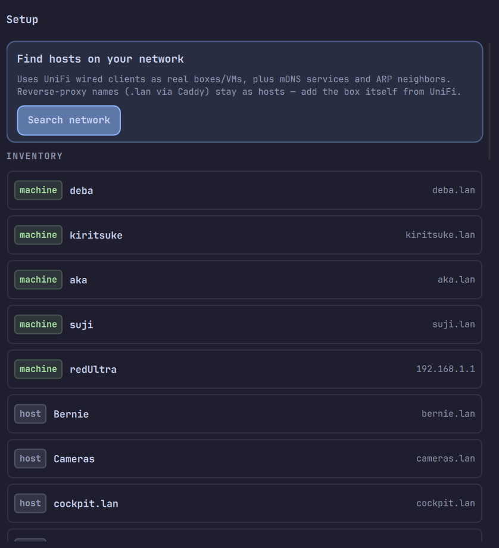

<div align="center">


# Lanarchy

**Homelab status in the Omarchy bar — who is up, what sits behind Caddy, and what just appeared on the LAN.**

No typing IPs. Search the network, add boxes from UniFi / mDNS, keep `.lan` names as reverse-proxy hosts.

[](https://omarchy.org)
[](https://quickshell.org)
[](CHANGELOG.md)
[](LICENSE)

Plugin id: `donnie.homelab-mesh` · Install: `~/.config/omarchy/plugins/donnie.homelab-mesh/`  
Repo: [DonnieFi/OmarPlugs](https://github.com/DonnieFi/OmarPlugs) · Architecture: [`docs/architecture.md`](docs/architecture.md)

</div>

---

## The idea

A lab is not a flat list of IPs. You have real boxes (and VMs), a Caddy (or Traefik) front door, and a pile of `*.lan` names that all resolve to the same proxy.

Lanarchy keeps that straight:

| Kind | Example | Role |
|------|---------|------|
| **machine** | `yanagiba` @ `.92`, `homeassistant` @ `.178` | SSH / ICMP / telemetry |
| **host** | `ha.lan`, `git.lan` | Service names, often via reverse proxy |
| **proxy** | Caddy health URL | HTTP 2xx/3xx or TCP check |

<div align="center">

</div>

List is the default dash (Pulse-style colour lights). Map is the letterbox of the same mesh. Setup is where you **Search network** instead of hand-entering addresses.

<div align="center">

</div>

---

## Install

Plugins run **unsandboxed** inside your long-lived `omarchy-shell` process. Only add repos you trust; read them before enabling ([Omarchy shell plugins](https://omarchy.org)).

```bash
omarchy plugin add https://github.com/DonnieFi/OmarPlugs.git --enable
omarchy bar move donnie.homelab-mesh --section right
```

Dev symlink (this checkout is the plugin root):

```bash
ln -sfn /path/to/OmarPlugs ~/.config/omarchy/plugins/donnie.homelab-mesh
omarchy-shell shell rescanPlugins
omarchy plugin enable donnie.homelab-mesh
```

Validate:

```bash
omarchy plugin validate .
# or
omarchy plugin validate ~/.config/omarchy/plugins/donnie.homelab-mesh
```

Open:

```bash
omarchy-shell shell summon donnie.homelab-mesh
```

### Optional UniFi

```bash
cp unifi-secrets.json.example ~/.config/omarchy/plugins/donnie.homelab-mesh/unifi-secrets.json
# UNIFI_KEY=...   or JSON {"apiKey":"..."}
```

Shipped `inventory.json` is a tiny localhost starter. Use **Setup → Search network** to build your mesh.

`unifi-secrets.json` is gitignored. Never put keys in `inventory.json`. Lanarchy never auto-writes inventory from UniFi — Find hosts only proposes candidates you click to add.

---

## Usage

| Action | How |
|--------|-----|
| Open / close | Click the castle-socket bar icon · Esc closes |
| Choose the bar readout | **Right-click** the bar icon · or `omarchy-shell donnie.homelab-mesh barDisplay <mode>` |
| Refresh from the bar | Middle-click the bar icon |
| List / Map | Tabs or `l` / `m` |
| Hide / demote selected card | Detail **Move to LAN** or `h` — card joins the LAN bucket (still probed) |
| Restore to main map | List → **LAN** → **Show** (or **Show all on map**) |
| Animate map traffic | **Flow** tab (map) or `a` · persists as `settings.mapAnimate` |
| Refresh | `r` |
| Setup | `⚙ Setup` or `s` |
| Map select / notify | Arrows · Enter toggles ALERT/MUTE |
| Find hosts | Setup → **Search network** → **+ add** |
| Bootstrap a whole lab | Setup → **+ Add all machines** (or **+ Add everything**) |

### What **Search network** does

Rebuilds `snapshot.discover[]` from three sources and merges them:

| Source | Meaning | Classification |
|--------|---------|----------------|
| **UniFi** | Wired clients from your Cloud Gateway / UDM | Prefer **`machine`**. Strips `name ab:cd` MAC tails. Drops phones / cams / TVs / Chromecast-class noise. |
| **mDNS** | `avahi-browse` (`_ssh`, `_home-assistant`, …) | `machine` or `host` from service type |
| **ARP** | `ip neigh` with a MAC, named by reverse DNS (PTR) when the LAN answers | `host` fallback |

**What makes something a `machine`:** it answers on a login port (22 or 3389), or
mDNS says so. mDNS alone is not enough, because plenty of real boxes never publish
`_ssh` while plenty of appliances publish service records that look host-like.

Known inventory (ids, dns, labels, static ip/mac) is filtered out. History MAC/IP counts only for **`machine`** nodes so reverse-proxied hosts do not hide the real Caddy box. UniFi machines win over mDNS/neigh for the same device; machines list first.

Adding a UniFi machine prefers a `.lan` DNS guess plus IP/MAC — lab DNS, not raw typing.

Names are resolved for you, from three sources in order: the mDNS host field,
reverse DNS (PTR), then `hostname -s` over SSH for any box whose key you already
hold. So Setup offers `deba` rather than `10.0.0.5`. Scanning never writes to your
`~/.ssh/known_hosts`. For everything else, a UniFi API key is the best name source
on a UniFi LAN, since the gateway already knows every client by name. Synthetic resolver answers (`_gateway`, `localhost`) are
rejected, mDNS pairing ids fall back to the resolved host name, and a box on both
wifi and ethernet is offered once, not twice.

**+ Add all machines** adds every found `machine` in a single inventory write, which
is the fast way to bootstrap. **+ Add everything** also takes the `host` rows, which
on a busy LAN includes TVs and phones, so it is the deliberate option rather than
the recommended one.

Without UniFi secrets, Search still runs mDNS + ARP with weaker names.

---

## Knowing what a box is

The machine card's top line names the platform instead of repeating the word
"machine". Nothing extra is probed to work it out:

| Source | Gives | Confidence |
|--------|-------|------------|
| `uname -s` over the telemetry hop | exact family plus release | certain |
| Apple mDNS services (`_companion-link`, `_airplay`, ...) | macOS | likely |
| UniFi `os_name` | family | likely |
| ICMP TTL in the ping reply (64 / 128 / 255) | `UNIX` / `WINDOWS` / `APPLIANCE` | guess, shown with `?` |

A TTL of 64 cannot separate Linux from macOS, so it reports `UNIX?` rather than
picking one. With no evidence the card says `MACHINE`.

Set `"role": "router"` on a node to label it `ROUTER` outright.

---

## What the map's motion means

**Flow is measured throughput, not decoration.** Every packet on the map comes from
`rates` (`rx_bps` / `tx_bps`) read off the interface counters:

| You see | It means |
|---------|----------|
| Packets streaming | Real measured bytes. Count and speed both scale with the rate |
| Two lanes, different shades | rx walks the route forwards, tx walks it back |
| A still line | **No telemetry for either endpoint.** Not measured, as opposed to idle |
| A dim lane | An endpoint's health check is down. The bytes are still real |

Local telemetry (`/proc/net/dev`, sysfs) needs no SSH and no credentials, so the box
running the panel always has live rates. Other machines need SSH with `BatchMode`;
without it their edges stay still, which is the honest answer rather than a fake pace.

Set `"telemetry": false` on a node to opt it out.

---

## The bar readout

The castle mark carries a number, so the bar answers "is the lab fine?" without a click.
Right-click the icon to pick what it shows:

| Mode | Shows |
|------|-------|
| `downs` (default) | `3↓` when something is down, `2!` when degraded, `✓` when all is well |
| `upfrac` | `12/14` up over tracked |
| `worstrtt` | the slowest node's RTT |
| `wan` | `↓ down ↑ up` through the router |
| `none` | icon only |

The mark itself still colours green / amber / red and alarms when a node goes down.
The choice is stored in `inventory.json` under `settings.barDisplay`.

---

## Configure

Bar widget setting (also in `shell.json` under the widget entry):

| Key | Default | Notes |
|-----|---------|-------|
| `refreshIntervalSec` | `15` | 5–120 |

Inventory and sidecars live in the plugin install directory (`~/.config/omarchy/plugins/donnie.homelab-mesh/` after `plugin add`):

| File | Purpose |
|------|---------|
| `inventory.json` | v2 nodes + optional `settings` / `edges`. Seeded from the shipped `inventory.default.json` on first run and never tracked, so `omarchy plugin update` cannot conflict with your lab |
| `history.json` | RTT sparklines / events |
| `notify-state.json` | Fail streaks + unknown-neighbor mute |
| `snapshot.json` | Last glance (daemon / probe) |
| `unifi-secrets.json` | API key (optional) |

Useful `inventory.json` settings:

```json
{
  "schemaVersion": 2,
  "settings": {
    "failStreakThreshold": 3,
    "unknownNeighborNotify": true,
    "unifi": { "url": "https://192.168.1.1", "site": "default" },
    "speedtestUrl": "https://files.lan/",
    "homeGatewayMac": "02:00:5e:10:00:01",
    "batteryIntervalSec": 300
  },
  "nodes": []
}
```

### Collector pace (laptops)

The collector is gated so a closed panel is not a permanent background scan:

| Setting | Default | Effect |
|---------|---------|--------|
| `homeGatewayMac` | unset | When set and the current default gateway's MAC does not match, probing **pauses**. Keeps your lab's hostnames off coffee-shop wifi. Opening the panel probes anyway |
| `batteryIntervalSec` | `300` | Probe interval on battery while the panel is closed |
| `batteryBackoff` | `true` | `false` restores the old always-on pace |
| `closedIntervalSec` | unset | Explicit panel-closed interval on mains |

Open the panel and you always get the full `refreshIntervalSec` pace. A desktop with
no battery and no `homeGatewayMac` behaves exactly as before.

Empty inventory writes are refused. Setup/form saves go through `inventory_cli.py` only when you act — nothing silent.

---

## Remove

```bash
omarchy plugin remove donnie.homelab-mesh
```

That disables and removes the plugin checkout/symlink. Your state files under `~/.config/omarchy/plugins/donnie.homelab-mesh/` may remain if the folder was not a pure git checkout — delete that directory if you want a clean slate (`inventory.json`, history, secrets, snapshot).

---

## Dependencies

| Need | Required? | Notes |
|------|-----------|-------|
| Omarchy + Quickshell | yes | Bar widget host |
| Python 3 | yes | `probe.py`, `daemon.py`, CLIs |
| `ping`, `curl`, `ip` | yes | Probes / neigh |
| `avahi-browse` | optional | Richer mDNS discover |
| UniFi OS API key | optional | Named wired machines for Search |
| `iperf3` | optional | Speedtest fallback only if already installed |
| SSH | optional | Machine telemetry / talkers / remote speedtest |

---

## IPC

```bash
omarchy-shell shell summon donnie.homelab-mesh
omarchy-shell shell hide donnie.homelab-mesh
omarchy-shell shell rescanPlugins
```

Plugin IPC (no mouse required):

```bash
omarchy-shell donnie.homelab-mesh status            # "1 down · 8 tracked · <as_of>"
omarchy-shell donnie.homelab-mesh open|close|toggle
omarchy-shell donnie.homelab-mesh map|list|setup
omarchy-shell donnie.homelab-mesh modes             # the bar readout chooser
omarchy-shell donnie.homelab-mesh barDisplay wan    # set the readout directly
omarchy-shell donnie.homelab-mesh refresh
```

One-shot collector (debug):

```bash
cd ~/.config/omarchy/plugins/donnie.homelab-mesh
python3 probe.py                 # glance JSON on stdout + snapshot
python3 probe.py wol <id|mac>
python3 probe.py speedtest --id <machine>
python3 inventory_cli.py dump
python3 history_cli.py sparkline --id <node>
```

---

## Icons & chrome

<div align="center">

</div>

| Affordance | Meaning |
|------------|---------|
| **Castle-socket** | Bar + header mark; alarms when glance has downs |
| **● / ○** | Filled = up/down known; hollow = unknown / probing |
| **Green / yellow / red** | Theme status on **both** fill and border (up / degraded / down) — no separate “hot RTT” wash |
| **reverse proxy** subline | Caddy (or first proxy group) — LAN service edges hub here |
| **router** subline | `role: router` / `mapBand: router` machine (e.g. redUltra) — WAN bar + rates |
| **LIVE · …** pill | Aggregate health + `as_of` |
| **Map / List** | View tabs |
| **ALERT / MUTE** | Per-node notify on map cards |
| **Sparklines** | Recent RTT from history |
| **machine / host / proxy** chips | Setup inventory type |
| **unifi · box / mdns / arp** | Discover source on Found rows |

---

## How it works

```text
inventory.json  ──►  daemon.py (~15s)  ──►  probe.py
                                              │
                    ┌─────────────────────────┼─────────────────────────┐
                    ▼                         ▼                         ▼
              ICMP / SSH               UniFi OS API              mDNS + ARP
                    │                         │                         │
                    └────────────► snapshot.json ◄──────────────────────┘
                                         │
                              Panel.qml + notify-state
```

Deeper sidecar formats: [`docs/architecture.md`](docs/architecture.md).

---

## Versions

Version lives in **`manifest.json`** only. Releases bump it, add a [CHANGELOG.md](CHANGELOG.md) entry, and should be tagged `vX.Y.Z`.

---

## Credits

Built for [Omarchy](https://omarchy.org) / Quickshell. List density and panel patterns follow [Pulse](https://github.com/nixfred/pulse) by Fred Nix. Discover and glance UX are Lanarchy’s own.

MIT — see [LICENSE](LICENSE).
